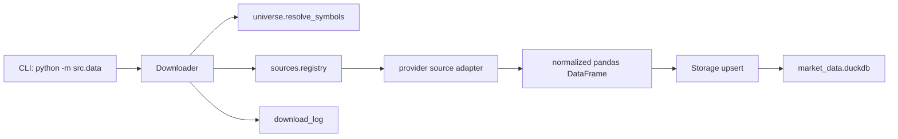

# Data Update Module

The data update module lives under `agent/src/data/`. It is the local market
data ingestion path for daily OHLCV, intraday OHLCV, capital flow, and stock
master data. It writes to the DuckDB market database configured by
`DataDownloadConfig`.

## Runtime Shape

- `__main__.py` is the CLI entry point for `python -m src.data`.
- `downloader.py` owns orchestration: resolve symbols, choose date windows,
  fetch data in batches, upsert frames, and write `download_log` rows.
- `universe.py` owns market universe resolution and latest trade-date helpers.
- `sources/registry.py` owns source construction and fallback chains.
- `sources/*.py` implement provider adapters for Tencent, TDX, TDX offline ZIP,
  and THS/AKShare.
- `storage.py` owns DuckDB schema, migrations, upserts, reads, and download logs.
- `rate_limiter.py` contains HTTP-source backoff and batch pause behavior.

## Data Flow

## Update Modes

- Daily OHLCV uses per-symbol incremental windows. If a symbol has data through
  `2026-06-10`, the next run starts that symbol at `2026-06-11`; lagging symbols
  are grouped by their own start date.
- Intraday OHLCV defaults to the latest 30 calendar days when no explicit range
  is supplied.
- Capital flow defaults to the latest inferred trade date and is only available
  through the THS/AKShare path.
- Full mode chains stock info, daily data, intraday 60m/30m/15m, and optionally
  capital flow.

## Storage Tables

- `stock_info`: stock master data and market cap fields.
- `daily_ohlcv`: daily bars keyed by `(code, trade_date)`.
- `intraday_ohlcv`: intraday bars keyed by `(code, interval, trade_date, bar_time)`.
- `capital_flow`: per-symbol daily capital flow keyed by `(code, trade_date)`.
- `download_log`: audit trail for every write run.

All market tables use upsert/replace semantics. Re-running the same date range
refreshes provider-corrected bars instead of appending duplicates.

## Source Selection

- Single CLI downloads map `--source auto` to Tencent.
- Full mode uses a fixed chain: stock info, `tdx_offline` for daily gaps, Tencent
  for intraday, and THS when capital flow is enabled.
- Fallback chains are centralized in `agent/src/data/sources/registry.py`.
- Source construction is also centralized in the registry, so downloader tests
  can inject `Storage` without accidentally passing storage arguments to source
  constructors.

## Extension Points

To add a source, implement `BaseDataSource`, register it in
`sources/registry.py`, add fallback behavior if needed, then add narrow tests
for availability, normalization, and downloader orchestration. To add a data
type, keep provider normalization in the source adapter and add the DuckDB table
plus upsert/read functions in `storage.py`.
